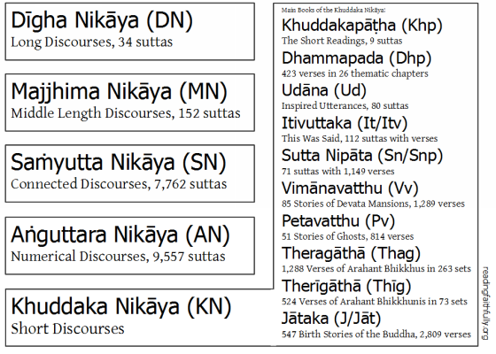

Le Sutta Pitaka, « La corbeille des enseignements », est la deuxième des trois divisions du canon pali Tipitaka sur lequel se base le courant theravada. Elle contient des milliers de textes d'enseignement1 répartis en cinq sections (nikaya), dont quatre sont intégrées sous le nom d’agamas dans le canon mahayana. Ces suttas seraient les enseignements du Bouddha transmis oralement, puis couchés par écrit probablement au ier siècle av. J.-C.. 

&nbsp;

{:. loading="lazy"}

Visualisation de la corbeille des enseignements
{:.figcaption}

## Composition

La collection renferme plus de dix mille suttas, dont 8777 très courts contenus dans l’Anguttara Nikaya.

Les cinq sections du Sutta Pitaka :

1. Le [Digha Nikaya](/DN){:.heading.flip-title} ---, les longs discours, comportant 34 suttas ;
2. Le [Majjhima Nikāya](/MN){:.heading.flip-title} ---, les discours de longueur moyenne comportant 152 suttas regroupés en 5 sections ;
3. Le [Samyutta Nikaya](/SN){:.heading.flip-title} ---, les discours groupés ou connectés, groupés en 5 sections de 10 à 15 suttas chacune ;
4. L'[Anguttara Nikaya](/AN){:.heading.flip-title} ---, les discours des facteurs ultérieurs ou discours numériques, classé en 11 groupes, le premier portant sur un sujet simple, le deuxième sur un sujet double, le troisième sur un sujet triple, et ainsi de suite jusqu'à 11 (en tout plus de 2300 suttas) ;
5. Le [Khuddaka Nikāya](/KN){:.heading.flip-title} ---, les petits discours ou livres courts, composé de 15 livres parmi lesquels se trouvent des textes bien connus tels que le Dhammapada, le Sutta Nipata et l'Udana.
